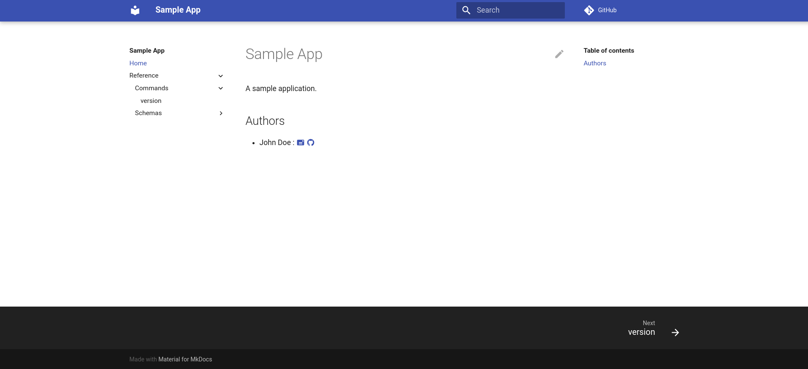

<p align="center">
  <a href="https://github.com/wmorellato/brandon/#gh-light-mode-only">
    
  </a>
  <a href="https://github.com/wmorellato/brandon/#gh-dark-mode-only">
    
  </a>
</p>

An utility to create command line application stubs from a [YAML Specification](https://wmorellato.github.io/brandon/specification/spec/). For now, the only available language for creating stubs is Python, in a multifile structure. The [builders page](https://wmorellato.github.io/brandon/reference/builders/python/) has details about builders.

## Usage

```
Brandon - An utility to create command line applications from their YAML specifications.

Usage:
    brandon [command]

Commands:
    brandon generate project|docs|summary     Generation of different parts of the project.
    brandon version                           Show the version and exit.
```

After creating the YAML file describing the application, pass it to Brandon as an argument.

A simple command line application is shown below. It has only one command, which prints its version and exits.

```yaml title="Describing a sample application"
name: Sample App
version: 0.0.1
description: A sample application.
authors:
- name: John Doe
  email: john.doe@gmail.com
  url: https://github.com/john.doe
tags: ['cli', 'utils']
license: MIT License
url: https://github.com/john.doe/sample-app
languages: ['python']
cli:
  version:
    description: Prints the version.
```

You create the stub by passing it to Brandon:

`$ brandon generate project cli.yaml`

After generating the stub, this application can be called by:

`$ sample-app version`

> **Note**  
> Brandon doesn't create any logic. It just creates the stub.

You can also create the documentation for the application. The documentation is generated using MkDocs and Material for MkDocs. The image below shows the output site for the definition above.


